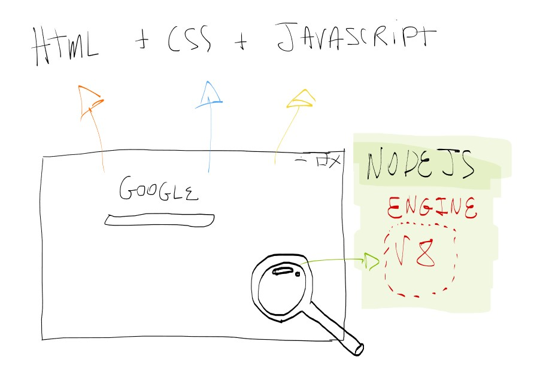
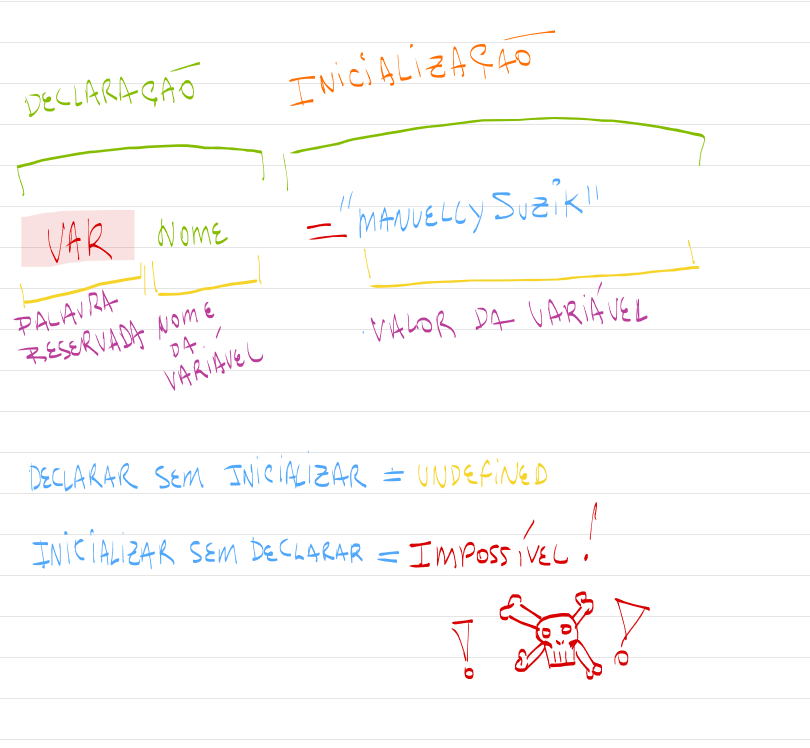

<h1 align="center">
  
</h1>

# Tema da Aula

Turma Online 22 - B3  | Back-end | Semana X | 2023 | Professora X

### Instruções
Antes de começar, vamos organizar nosso setup.
* Fork esse repositório 
* Clone o fork na sua máquina (Para isso basta abrir o seu terminal e digitar `git clone url-do-seu-repositorio-forkado`)
* Entre na pasta do seu repositório (Para isso basta abrir o seu terminal e digitar `cd nome-do-seu-repositorio-forkado`)
* [Add outras intrucoes caso necessario]

### **Resumo**
O que veremos na aula de hoje?

* O que é Javascript
* Variáveis
* Tipos de dados
* Operadores
  
<br>

# **Conteúdo**

## O que é Javascript
 <br>
 
### Introdução: Javascript não é Java
  ( Penso eu que ) Muitas de vocês provavelmente já ouviram falar da linguagem de programação JAVA pois essa linguagem é muito famosa no mundo da programação , a boa notícia é que: é completamente normal - até entre pessoas que já conhecem um pouco de programação - que algumas pessoas não saibam a diferença entre essas duas linguagens, vou adiantar pra vocês que JAVA e JAVASCRIPT são linguagens muito diferentes, tanto na sua syntaxe ( a forma como são escritas ) quanto em suas finalidades.
  
  Ao longo de sua caminhada você saberá ver a diferença entre elas, mas se ficou curiosa e não quer esperar pode [acessar aqui](https://www.java.com/pt-BR/download/help/java_javascript_pt-br.html#:~:text=Diferenças-chave%20entre%20o%20Java,executado%20apenas%20em%20um%20browser.) e ver as principais diferenças entre as duas.
  <br>

### Por que Javascript?
  O Javascript nasceu da necessidade de tornar as páginas web mais dinâmicas, e desde então cresceu tanto que superou enormemente as expectativas até se tornar a maioral para as aplicações client-side ( famoso front-end ). 

  Não apenas no front-end mas javascript também mostrou ser uma ótima alternativa também em aplicações server-side ( back-end ), e por isso é considerada a **Número 1** na lista das linguagens de programação mais indicadas para a web - [segundo a geeksforgeeks](https://www.geeksforgeeks.org/10-backend-programming-languages-for-web-developers-in-2022/).

  Javascript tem uma comunidade muito ativa e numerosa, isso faz com que seja muito fácil encontrar diversos conteúdos para melhorar seu nível de código, além de várias bibliotecas pra colocar em seus projetos. O javascript tem uma linha de aprendizado muito boa para quem está começando pois conta com documentações muito claras e detalhadas das funcionalidades nativas da linguagem.

  Para quem estiver interessado em começar a aprender essa linguagem as notícias não poderiam ser melhores afinal hoje é muito comum ver diversas empresas - nacionais e internacionais - que estão em busca de bons desenvolvedores Javascript para criar e dar manutenção a sistemas criados para a web. Algumas empresas que talvez vocês conheçam utilizam Javascript: Netflix, Uber e LinkedIn.
  <br>

### NodeJS
  Vamos ser simples: O NodeJS executa códigos javascript fora de um navegador.
  
  Como o Javascript foi escrito - em sua natureza - para a WEB os navegadores tem um mecanismo que é capaz de ler javascript e executar. Se você tirar essa peça do navegador você terá uma **engine** que é a peça principal para o NodeJS funcionar. Essa ilustração talvez possa te ajudar ~~ou não~~
  
  
Baixe o NODEJS para seu computador [aqui](https://nodejs.org/en/download/)

  - **Console**
    Como normalmente o navegador é responsável por "exibir" a execução de códigos Javascript contidos nas páginas web. Se o NODEJS está fora do navegador, como conseguimos observar as saídas de execução de nossos códigos Javascript? A resposta é: Pelo console.

## Variáveis
 
### Declaração
 Declarar uma variável faz com que o NodeJS diga ao nosso computador separar um espaço na memória. Para isso usamos a palavra reservada do Javascript: `var` assim, o computador estará pronto para separar um espaço na memória e dar um nome a ela.

 Veja o exemplo abaixo:

 ```Javascript
 var nomeDaMinhaVariavel
 ```

 Isso é o suficiente para declararmos um espaço na memória que se chamará `nomeDaMinhaVariavel`. Podemos usar a analogia de que se a memória do computador fosse uma gaveta, o nome da variável seria a etiqueta. Dessa forma sempre que quiséssemos **recuperar** esse valor só precisaríamos ir até a gaveta com aquela etiqueta.

### Inicialização
O valor daquele espaço só será preenchido quando inicializarmos aquela variável.

Veja o exemplo de uma variável inicializada:

 ```Javascript
 var nomeDaMinhaVariavel = "Aprender com reprograma é bom demais"
 ```

 Agora sim, eu acabei de pegar uma frase - vamos chamar de string de agora em diante, ta? - e jogar dentro da minha gaveta com a etiqueta `nomeDaMinhaVariável`

 Aqui vai uma ilustração:
 

 ### let e var
Existe duas formas de declarar variáveis no Javascript, uma é utilizando a palavra reservada `var` como apresentei lá em cima, porém, existe também a outra forma de declarar uma variável utilizando a palavra reservada `let`.

Podemos declarar dessas duas formas, mas por enquanto vamos priorizar usar `var` pois existe uma certa diferença entre elas. Vamos dizer que o `let` é usado dentro de **blocos** enquanto o `var` normalmente é usado dentro das funções;

O termo de variável significa que o valor ou tipo que será armazenado poderá ser alterado ao longo da execução do seu código.

Exemplo de variável:
O preço da picanha, sabemos que desde 2023 o preço da picanha vem diminuindo nos supermercados do nosso país. Como esse valor será variável e precisará ser ajustado poderíamos facilmente usa-lo como uma variável

```Javascript
var valorDaPicanha = 29.00
```

### Const
Como na matemática, na programação também temos valores que podem mudar ( variáveis ) e valores constantes, mas no Javascript para declarar um valor que não sofrerá alteração temos a palavra reservada `const`.

Aqui o exemplo de **declaração e inicialização** de uma constante:
```Javascript
const issoEUmaConstante = true
```

Como exemplo de uma constante:
O valor de π (pi) é uma constante. Para utilizar esse valor em nosso código poderíamos armazena-lo como uma constante.

```Javascript
const valorDePi = 3.14
```

Ao longo de seu aprendizado você saberá quando usar uma constante ou uma variáviável.
### Tipos de dados

### Operadores

***
### Exercícios 
* [Exercicio para sala](https://github.com/mflilian/repo-example/tree/main/exercicios/para-sala)
* [Exercicio para casa](https://github.com/mflilian/repo-example/tree/main/exercicios/para-casa)

### Material da aula 

### Links Úteis
- [Lorem Ipsum](https://www.lipsum.com/feed/html)
- [Lorem Ipsum](https://www.lipsum.com/feed/html)
- [Lorem Ipsum](https://www.lipsum.com/feed/html)
- [Lorem Ipsum](https://www.lipsum.com/feed/html)


<p align="center">
Desenvolvido com :purple_heart:  
</p>

