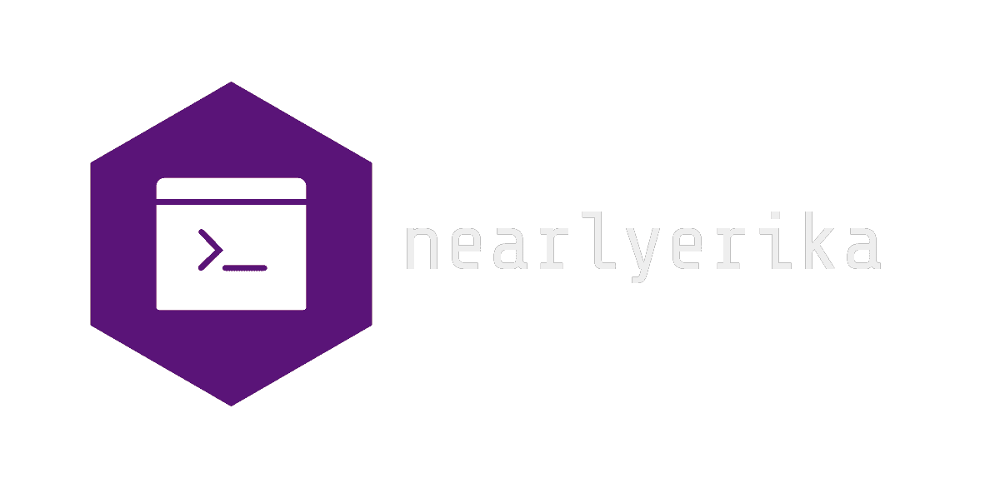
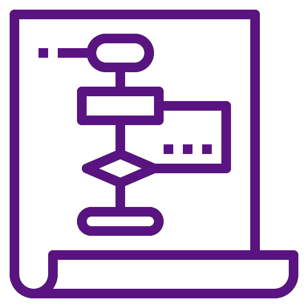

<h1 align="center">
    
</h1>

# Semana 2: resumo da aula

## Introdução ao Javascript

    NodeJS

***
### Variables

    >declaration vs. initialization  
    >let vs. var  
    >const  
    >reserved words  
    >case sensitivity

***

### Datatypes

***

### Operators

Aprendemos sobre os operadores lógicos básicos, como 
    

***
